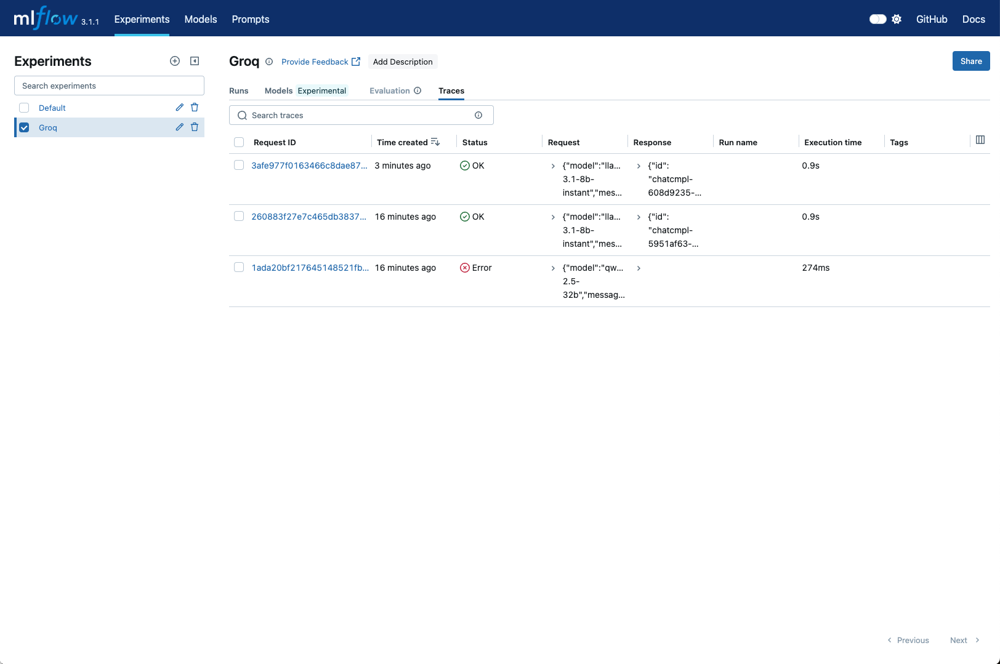

# Groq + MLflow Tracking Example

[MLflow](https://mlflow.org/) is an open-source platform developed by Databricks to assist in building better Generative AI (GenAI) applications.

MLflow provides a tracing feature that enhances model observability in your GenAI applications by capturing detailed information about the requests you make to the models within your applications. Tracing provides a way to record the inputs, outputs, and metadata associated with each intermediate step of a request, enabling you to easily pinpoint the source of bugs and unexpected behaviors.

The MLflow integration with Groq includes the following features:

- Tracing Dashboards: Monitor your interactions with models via Groq API with dashboards that include inputs, outputs, and metadata of spans
- Automated Tracing: A fully automated integration with Groq, which can be enabled by running mlflow.groq.autolog()
- Easy Manual Trace Instrumentation: Customize trace instrumentation through MLflow's high-level fluent APIs such as decorators, function wrappers and context managers
- OpenTelemetry Compatibility: MLflow Tracing supports exporting traces to an OpenTelemetry Collector, which can then be used to export traces to various backends such as Jaeger, Zipkin, and AWS X-Ray
- Package and Deploy Agents: Package and deploy your agents with Groq LLMs to an inference server with a variety of deployment targets
- Evaluation: Evaluate your agents using Groq LLMs with a wide range of metrics using a convenient API called mlflow.evaluate()



## Overview

This example demonstrates how to integrate Groq API calls with MLflow for comprehensive experiment tracking and model monitoring. Built as a complete, end-to-end template that you can fork, customize, and deploy for production ML workflows.

**Key Features:**
- 🤖 Groq API integration for fast LLM inference
- 📊 MLflow automatic logging and experiment tracking
- 🔧 Local file-based tracking with optional remote server support
- 📈 Automatic instrumentation of Groq API calls
- 🎯 Token usage, latency, and response tracking
- Sub-second response times, efficient concurrent request handling, and production-grade performance powered by Groq

## Architecture

**Tech Stack:**
- **AI Infrastructure:** Groq API for fast LLM inference
- **Experiment Tracking:** MLflow for logging and monitoring
- **Backend:** Python with automatic instrumentation
- **Storage:** Local file system (with optional remote tracking server)

## Features

### Automatic Logging
With `mlflow.groq.autolog()`, every Groq API call is automatically tracked:

- **Request/Response Logging**: All prompts and completions
- **Performance Metrics**: Latency, tokens per second, total tokens
- **Model Parameters**: Temperature, max tokens, model name
- **Cost Tracking**: Token usage for cost analysis
- **Error Tracking**: Automatic error capture and logging

### Experiment Organization
```python
# Set experiment name for organized tracking
mlflow.set_experiment("Groq")

# All runs will be grouped under this experiment
```

### Local vs Remote Tracking
```python
# Local file-based tracking (default)
mlflow.set_tracking_uri(f"file://{pathlib.Path.cwd() / 'mlruns'}")

# Or connect to remote MLflow server
# mlflow.set_tracking_uri("http://localhost:5000")
```

## Usage

### Basic Example
```python
import mlflow
import groq
import os

# Enable automatic logging
mlflow.groq.autolog()

# Create Groq client
client = groq.Groq(api_key=os.getenv("GROQ_API_KEY"))

# Make API call - automatically logged
response = client.chat.completions.create(
    model="llama-3.1-8b-instant",
    messages=[{"role": "user", "content": "Hello!"}]
)
```

### Viewing Results
1. **Local UI**: Run `mlflow ui` in your project directory
2. **Navigate to**: http://localhost:5000
3. **Explore**: Experiments, runs, metrics, and artifacts

## Observability Features


With this setup, you'll get:

- **Experiment Tracking**: Organize runs by experiment name
- **Parameter Logging**: Model settings, prompt templates, system messages
- **Metrics Tracking**: Response time, token counts, cost estimates
- **Artifact Storage**: Save prompts, responses, and model outputs
- **Run Comparison**: Compare different models and parameters
- **Model Registry**: Version and deploy your best configurations

## Configuration

### Environment Variables
- `GROQ_API_KEY`: Your Groq API key (required)
- `MLFLOW_TRACKING_URI`: MLflow tracking server URI (optional)
- `MLFLOW_EXPERIMENT_NAME`: Default experiment name (optional)

### Supported Models
The example uses `llama-3.1-8b-instant` by default, but you can use any Groq-supported model:
- `llama-3.1-8b-instant`
- `llama-3.3-70b-versatile`
- `meta-llama/llama-4-scout-17b-16e-instruct`
- `meta-llama/llama-4-maverick-17b-128e-instruct`
- Full list of [Groq models here](https://console.groq.com/docs/models) 

## Customization
This template is designed to be a foundation for you to get started with. Key areas for customization:
- **Model Selection:** Update Groq model configuration in `main.py`
- **Experiment Organization:** Customize experiment names and run tags
- **Tracking Server:** Configure remote MLflow server for team collaboration
- **Custom Metrics:** Add domain-specific metrics and evaluations

## Advanced Usage

### Custom Metrics and Tags
```python
with mlflow.start_run():
    # Your Groq API calls here
    
    # Log custom metrics
    mlflow.log_metric("custom_score", 0.95)
    
    # Add tags for organization
    mlflow.set_tag("model_version", "v1.0")
    mlflow.set_tag("use_case", "customer_support")
```

### Batch Processing with Tracking
```python
def process_batch(messages):
    with mlflow.start_run(run_name="batch_processing"):
        results = []
        for i, message in enumerate(messages):
            response = client.chat.completions.create(
                model="llama-3.1-8b-instant",
                messages=[{"role": "user", "content": message}]
            )
            results.append(response)
            mlflow.log_metric(f"batch_item_{i}_tokens", len(response.choices[0].message.content))
        return results
```

### Remote Tracking Server
```python
# Connect to remote MLflow server
mlflow.set_tracking_uri("http://your-mlflow-server:5000")

# Or use MLflow Cloud/Databricks
mlflow.set_tracking_uri("databricks://profile-name")
```

## Troubleshooting

1. **Missing API Key**: Ensure `GROQ_API_KEY` is set in your `.env` file
2. **MLflow UI Issues**: Run `mlflow ui --host 0.0.0.0` for network access
3. **Permission Errors**: Check write permissions for the `mlruns` directory
4. **Dependencies**: Run `uv sync` to ensure all packages are installed


## Quickstart Tutorial

The example below shows how to run this template with `uv` and `pyenv` on MacOS. This section is for those who are relatively new to Python development.

### 1. Get the code

First, clone this repository and navigate to the project directory:

```bash
git clone https://github.com/janzheng/groq-mlflow-template
cd groq-mlflow-template/groq-mlflow-template
```

### 2. Install development tools

While not required, these tools are used for Python version management and package installation, and will make your life much easier down the line:

```bash
brew install pyenv curl uv                  # Python manager + fast env / pip tool
# echo 'export UV_NO_BUILD=1' >> ~/.zshrc   # Prevents UV from rebuilding packages
```

The `UV_NO_BUILD=1` flag prevents uv from building packages from source, which speeds up installation and avoids common compilation issues. Sometimes you may run into dependency problems with MLFlow where it's unable to rebuild certain packages, and adding this line might help.


### 3. Set up Python version

Install and pin Python 3.12.5 for this project to ensure compatibility. Using `pyenv` ensures you can easily switch between python versions:

```bash
pyenv install 3.12.5    # Install Python 3.12.5 (one-time setup)
pyenv local 3.12.5      # Pin this version for the project
```

This creates a `.python-version` file that ensures everyone uses the same Python version.


### 4. Create isolated environment

Set up a virtual environment managed by uv for clean dependency isolation. This isolates your installed dependencies to just this project:

```bash
uv venv --python "$(pyenv which python)"   # Creates .venv directory
```

With uv, you don't need to manually activate the environment - `uv run` handles this automatically. However, you can still activate it manually if needed:

```bash
# Optional: activate manually for direct python/pip usage
source .venv/bin/activate
```

### 5. Install dependencies

Install the required packages with pinned versions to avoid dependency conflicts:

```bash
uv pip install \
  mlflow \
  'groq==0.26.*' \
  python-dotenv \
  setuptools --upgrade
```

The `groq==0.26.*` version is specifically chosen for MLflow compatibility. The `setuptools` upgrade restores the `distutils` module needed by some packages on Python 3.12+.

Create a `requirements.txt` file to track these dependencies:

```
mlflow
groq==0.26.*
python-dotenv
setuptools>=70
```

### 6. Configure your API key

Create a `.env` file with your Groq API key ([get one free here](https://console.groq.com)):

```bash
# .env file (never commit this to git)
GROQ_API_KEY=gsk_your_actual_api_key_here
```

Make sure to add `.env` to your `.gitignore` to prevent accidentally committing your API key.


### 7. Understanding the code

The `main.py` file demonstrates MLflow integration with automatic tracing:

```python
import pathlib
import mlflow
import groq
from dotenv import load_dotenv

load_dotenv()                                 # Load GROQ_API_KEY from .env
mlflow.set_tracking_uri(
  f"file://{pathlib.Path.cwd() / 'mlruns'}")  # Store traces locally
mlflow.set_experiment("Groq")                 # Organize runs by experiment
mlflow.groq.autolog()                         # Enable automatic tracing

client = groq.Groq()                          # API key loaded from environment
msg = client.chat.completions.create(
  model="llama-3.1-8b-instant",
  messages=[{
    "role": "user",
    "content": "Explain the importance of low latency LLMs."
  }]
)
print(msg.choices[0].message.content)
```

The `mlflow.groq.autolog()` call automatically captures all API interactions, including timing, token usage, and model parameters. In this example, we store the traces to a local folder, which we can then load into MLFlow. With MLFlow you can also run a standalone server, or connect to Databricks. Refer to [the documentation here](https://mlflow.org/docs/latest/genai/).


### 8. Run your first experiment

Execute the script to make your first tracked API call:

```bash
uv run main.py        # Runs the script and logs everything to ./mlruns
```

**What happens behind the scenes:**
When you run `main.py`, MLflow automatically creates a local file-based tracking store in the `./mlruns` directory. Each time you make a Groq API call, MLflow captures and saves:

- **Request data**: Your prompt, model parameters, timestamps
- **Response data**: The AI's response, token counts, latency metrics  
- **Trace artifacts**: Detailed execution logs as JSON files
- **Metadata**: Run IDs, experiment organization, tags

You'll see a folder structure like:
```
mlruns/
├── 0/                          # Default experiment
├── [experiment-id]/            # Your "Groq" experiment  
│   └── traces/
│       └── [trace-id]/         # Individual API call traces
│           ├── artifacts/      # Response data, JSON logs
│           ├── request_metadata/ # Input parameters, timestamps
│           └── trace_info.yaml # Run summary
```


### 9. View your results

Launch the MLflow UI to explore your experiment data:

```bash
uv run -- mlflow ui \
  --backend-store-uri "$(pwd)/mlruns" \
  --host 0.0.0.0 --port 5001
```

**How the UI works:**
The MLflow UI is a web server that reads directly from your local `mlruns` folder. The `--backend-store-uri` flag tells it exactly where to find your tracking data. When you open [http://localhost:5001](http://localhost:5001), you'll see:

- **Experiments** tab: Overview of all your runs organized by experiment name
- **Traces** tab: Detailed call-by-call analysis with timing and token metrics
- **Live updates**: As you run more experiments, the UI automatically reflects new data

The UI essentially provides a visual interface to browse the same files that `main.py` created in your `mlruns` directory.

> **Note:** We use port 5001 because macOS AirPlay Receiver occupies the default port 5000.


### 10. Ongoing development

For daily usage, simply run experiments and monitor results:

```bash
uv run main.py   # Each run creates new tracking data
# MLflow UI updates automatically at http://localhost:5001
```

Modify the model, prompts, or parameters in `main.py` and each run will be tracked separately for easy comparison.


## Next Steps
### For Developers
- **Create your free GroqCloud account**: Access official API docs, the playground for experimentation, and more resources via [Groq Console](https://console.groq.com).
- **Build and customize**: Fork this repo and start customizing to build out your own application.
- **Get support**: Connect with other developers building on Groq, chat with our team, and submit feature requests on our [Groq Developer Forum](community.groq.com).

### For Founders and Business Leaders
- **See enterprise capabilities**: This template showcases production-ready AI that can handle realtime business workloads with comprehensive tracking and monitoring.
- **Discuss Your needs**: [Contact our team](https://groq.com/enterprise-access/) to explore how Groq can accelerate your AI initiatives.

## License
This project is licensed under the MIT License - see the LICENSE file for details.

## Credits
Created with Groq API and MLflow integration for production-ready LLM tracking and monitoring.
